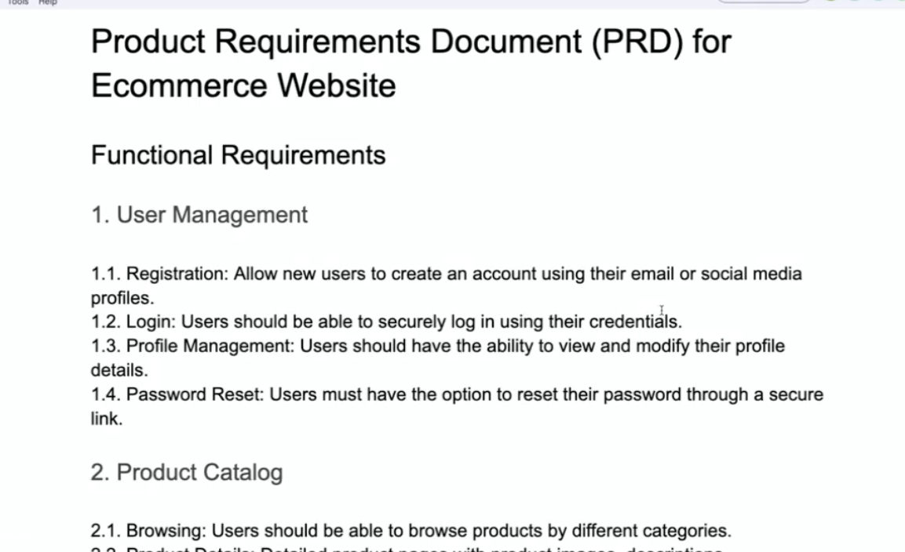
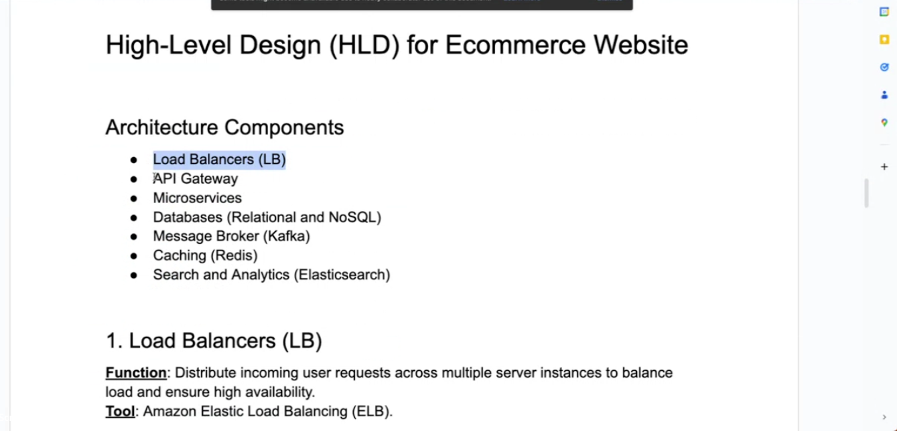
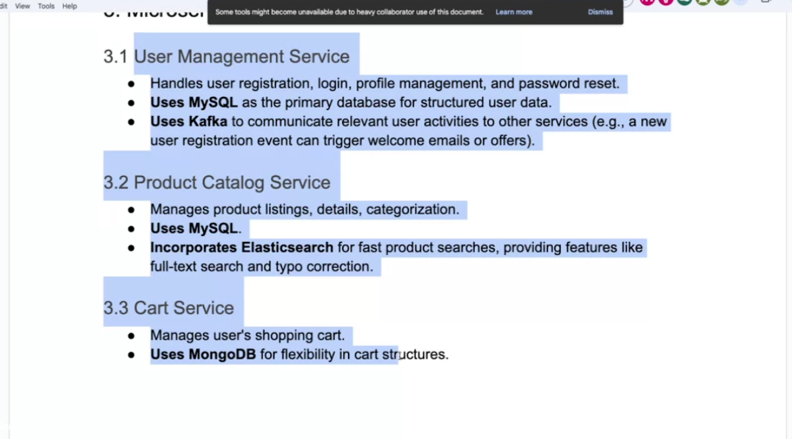
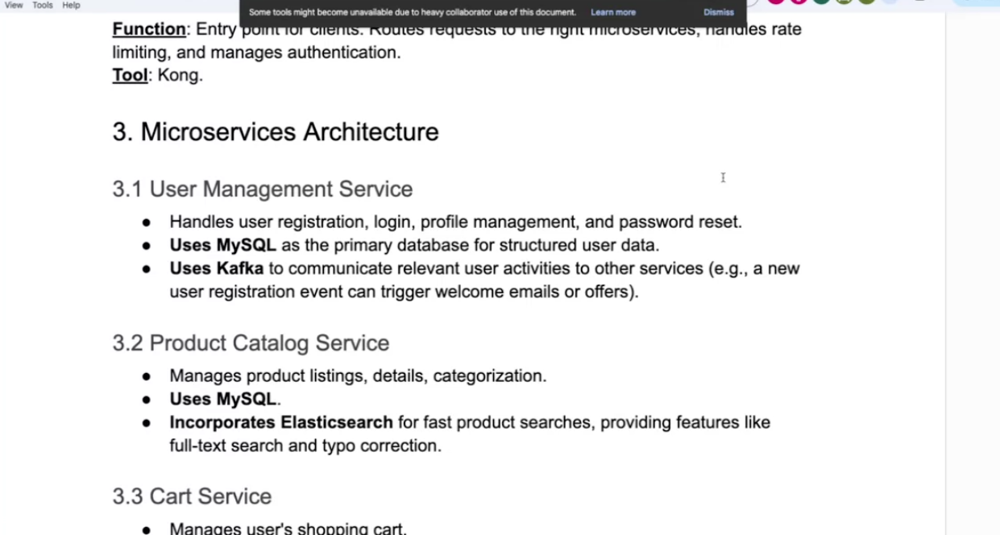
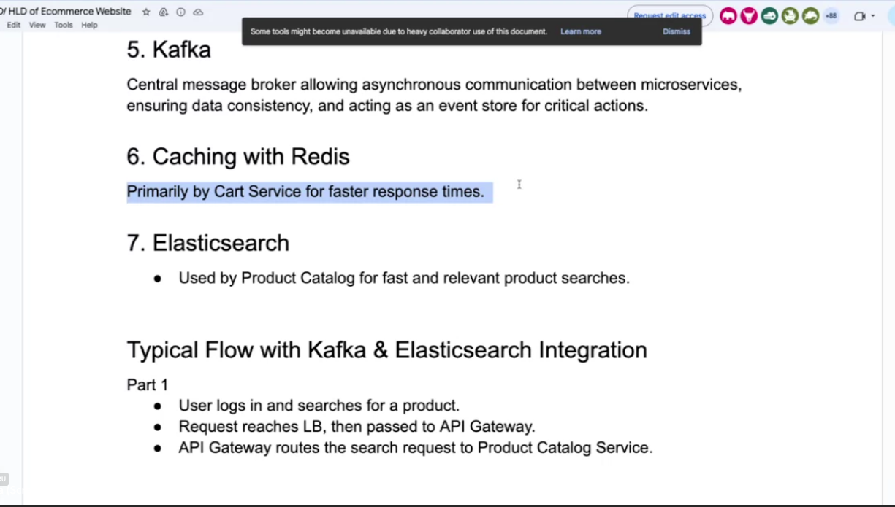
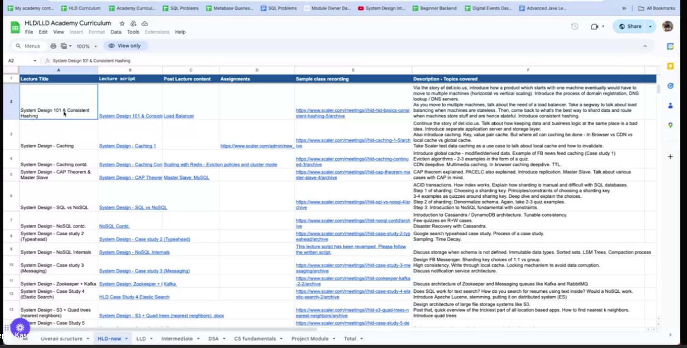

# api-design-and-deployment

{
"title" : "iphone 15 pro ",
"description" : "best iphone ever",
"price" : "80000",
"image" : "dummyurl"
}

create database productservice;
create user productserviceuser;
grant all privileges on productservice.\* to productserviceuser;

[https://start.spring.io/](https://start.spring.io/)

[https://mvnrepository.com/](https://mvnrepository.com/)

@contrller advice for global exceptions

https://docs.aws.amazon.com/codedeploy/latest/userguide/tutorials-windows-deploy-application.html

https://www.baeldung.com/spring-cloud-netflix-eureka

https://docs.stripe.com/api/payment_links/payment_links/create

https://auth0.com/blog/hashing-in-action-understanding-bcrypt/

https://www.baeldung.com/the-persistence-layer-with-spring-data-jpa

https://docs.google.com/document/d/1mbVgenkdi42SKv0R6YdoCkSWq0m-_SSatgLfKlsEC-E/edit

https://docs.google.com/document/d/1hntsVbVI0bwCJ9HjEZdkRsQRDlYnrHjJ98XgepVoEPY/edit#heading=h.woobbnl4zwds
